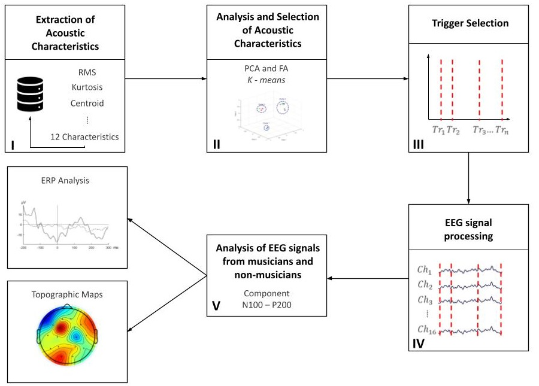

# Summary 

Control and Automation Engineer and Artificial Intelligence Enthusiast, interested in product development, Industry 4.0, data science and deep learning.
My most used tools are:

Python |  TensorFlow |  OpenCV |  MatplotLib |  Pandas |  Numpy |  Scikit-learn
:---:|:---:|:---:|:---:|:---:|:---:|:---:
  |   |  |  |  |    |    

# Projects

## AI, Machine Learning, Deep Learning

### [Coursera Self-Driving Cars Specialization](https://coursera.org/verify/specialization/8E8CXCBFQK5U)
Completed projects on: Longitudinal and Lateral Control, State Estimation and Localization, Visual Perception and Motion Planning.

### [Mobile Convolutional Neural Network for Neonatal Pain Assessment (Undergraduate Thesis Project)](https://youtu.be/PvChq7tH0Ac)
Developed a Convolutional Neural Network based on VGG-Face for pain assessment in newborns using methos like, transfer-learning, mobile environment optimization, data augmentation and Explainable AI.

 

- [Publication on LXCV Workshop @ CVPR 2021](https://research.latinxinai.org/workshops/cvpr/cvpr-2021.html)
- [Publication on IEEE Seasonal School on Digital Processing of Visual Signals and Applications (DPVSA)](https://wp.ufpel.edu.br/dpvsa/)

### [Lane Segmentation for Autonomous Vehicle Navigation using Keras](https://github.com/darkrubiks/Lane_Segmentation)

Using a U-net archictecture with Resnet as backbone the algorithm is able to detect lane markings.

### [Pose Estimation with TensorFlow](https://github.com/darkrubiks/tf-PoseNet)
Developed a pose estimation algorithm using a Tensorflow Lite model.

### Cortical activation patterns generated during listening to Brazilian music
Developed a methodology capable of classifying people as musicians or non-musicians using electroencephalogram signals using machine learning models.

- [Publication on the 17th Brazilian Symposium on Computer Music](https://doi.org/10.5753/sbcm.2019.10444)

## Web Scraping

### [Twitter Bot](https://github.com/darkrubiks/IRBR3_Twitter_bot)
Used the Twitter API and Yahoo Finance, to creat a bot for posting hourly tweets about the IRBR3 stock.

### [Reddit Bot](https://github.com/darkrubiks/Reddit_Image_Scraper)
Used the Reddit and Google Drive API, to creat a bot for scrapping images from any Reddit forum and uploading them to Google Drive.

## Kaggle Notebooks and Competitions

- [Aligning images using PCA](https://www.kaggle.com/darkrubiks/aligning-images-using-pca)
- [Mars 2020 Mission - Perseverence Landing - Comments Analysis with WordClouds and Ngrams](https://www.kaggle.com/darkrubiks/comments-analysis-with-wordclouds-and-ngrams)
- [K-means grouping Brazil Forest Fires](https://www.kaggle.com/darkrubiks/k-means-grouping-forest-fires)
- [Classifying Irish Times Headlines Categories](https://www.kaggle.com/darkrubiks/classifying-irish-times-headlines-categories)
- [NYC Airbnb Exploratory Analysis](https://www.kaggle.com/darkrubiks/nyc-airbnb-exploratory-analysis)
- [An exploratory study of Heart Desease](https://www.kaggle.com/darkrubiks/heart-disease-uci-kernel)

